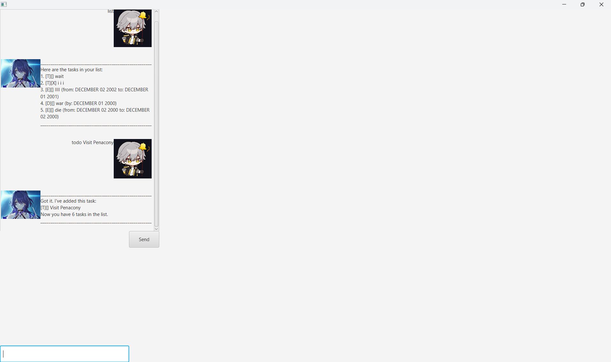

# Acheron User Guide



Utility chatbot to add tasks. These tasks are
1. todo: A task you want to do
2. deadline: A task with a deadline
3. event: A task with a start and end date

## Adding todo
As mentioned, a todo is a task which shows what
you want to do.

You can add it to the Acheron chatbot.

Example (Assume no tasks):\
`todo explore Penacony`

Output:
```
________________________________________________________
Got it. I've added this task:
[T][] explore Penacony
Now you have 1 tasks in the list.
________________________________________________________
```

## Adding deadlines
As mentioned, a deadline is a task with a due date.

You can add it to the Acheron chatbot.

Example (Assume no tasks):\
`deadline kill IX /by 2099-01-12`

Output:
```
________________________________________________________
Got it. I've added this task:
[D][] kill IX (by: JANUARY 12 2099)
Now you have 1 tasks in the list.
________________________________________________________
```

## Adding event
As mentioned, a deadline is a task with a start and end date.

You can add it to the Acheron chatbot.

Example (Assume no tasks):\
`event escape the dream /from 2024-01-12 /to 2024-05-12`

Output:
```
________________________________________________________
Got it. I've added this task:
[E][] kill IX (by: JANUARY 12 2024 to MAY 12 2024)
Now you have 1 tasks in the list.
________________________________________________________
```

There are also some other commands below

## Feature help

Enables to see a guide of the commands.

Example:\
`help`

Output:
```
________________________________________________________
Here are all the commands suppoted:

________________________________________________________
list
Display all existing tasks

E.g usage: list\n
________________________________________________________
mark (num)
Mark a task as complete

Inputs:
num: The task number

E.g usage: mark 1
________________________________________________________
mark (num)
Unmark a task as incomplete

Inputs:
num: The task number

E.g usage: unmark 1
________________________________________________________
find (text)
Find all tasks with names containing the text

Inputs:
text: The text keyword

E.g usage: find nihility
________________________________________________________
todo (task name)
Add a new todo task

Inputs:
task name: The name of the task

E.g usage: todo explore Penacony
________________________________________________________
deadline (task name) /by (date)
Add a deadline task

Inputs:
task name: The name of the task
date: The deadline date in the format YYYY-MM-DD

E.g usage: deadline kill IX /by 2099-01-12
________________________________________________________
event (task name) /from (from) /to (to)
Add a event task

Inputs:
task name: The name of the task
from: The from date in the format YYYY-MM-DD
to: The to date in the format YYYY-MM-DD

E.g usage: event escape the dream /from 2024-01-12 /to 2024-05-12
________________________________________________________
bye
Say goodbye to the chatbot

E.g usage: bye
________________________________________________________
```

## Feature list

Enables you to see all your existing tasks.

Example (Assume the 3 tasks above are added):\
`list`

Output:
```
________________________________________________________
Here are the tasks in your list:
1. [T][] explore Penacony
2. [D][] kill IX (by: JANUARY 12 2099)
3. [E][] kill IX (by: JANUARY 12 2024 to MAY 12 2024)

________________________________________________________
```

## Feature find

Enables you to find all tasks with a keyword

Assume there are 3 tasks
1. [T][] eat
2. [T][] eat again
3. [T][] sleep

Example (Assume the 3 tasks above are added):\
`find eat`

Output:
```
________________________________________________________
Here are the matching tasks in your list:
1. [T][] eat
2. [D][] eat again
________________________________________________________
```

## Feature mark

Enables you to mark a task as complete

Example (Assume you have a task):\
`mark 1`

Output:
```
________________________________________________________
Nice! I've marked this task as done:
[T][C] explore Penacony
________________________________________________________
```

## Feature unmark

Enables you to unmark a task as incomplete

Example (Assume you have a task):\
`unmark 1`

Output:
```
________________________________________________________
OK, I've marked this task as not done yet:
[T][] explore Penacony
________________________________________________________
```

## Feature bye

Enables you to say bye to the chatbot. It will
not terminate the session.

Example:\
`bye`

Output:
```
________________________________________________________
Bye. Hope to see you again soon!
________________________________________________________
```